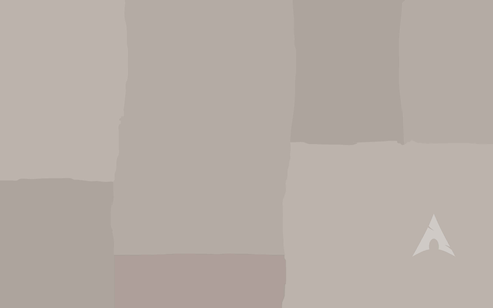

# Wallpapers for Arch Linux (3840 x 2400)

:blue_heart: I love Arch Linux, so I created some wallpapers.

:art: All wallpapers were created from scratch in inkscape.

❤️ Made by f4dzn

 👀 Below are some examples 

  
  

 :relaxed: I hope you like it. 
